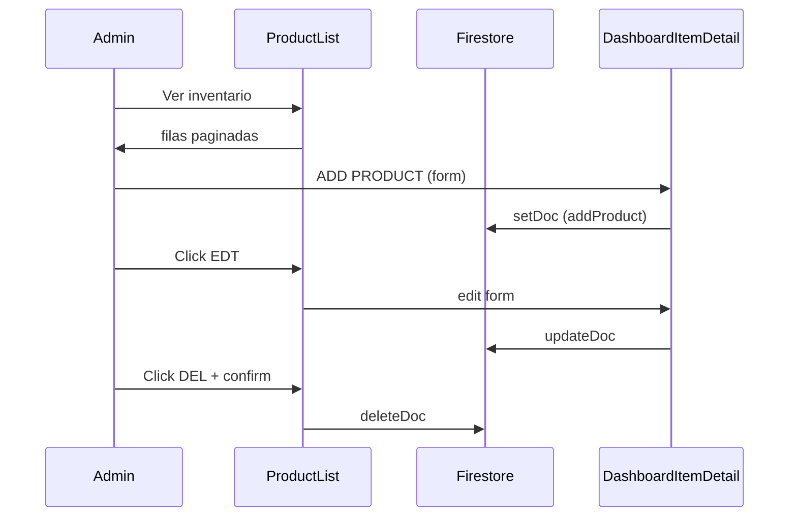

# STUDY_GUIDE.md — Tienda S.A.U. (pre-entrega)

> Guía pedagógica para estudiar el repositorio a fondo.  
> **Volúmenes:** 1–7 · **8** (componentes Dashboard)

---

## Índice

- [Volumen 1 — Mapa general y cadena de arranque](#volumen-1--mapa-general-y-cadena-de-arranque)
- [Volumen 2 — CartContext línea por línea](#volumen-2--cartcontext-línea-por-línea)
- [Volumen 3 — Páginas del dashboard](#volumen-3--páginas-del-dashboard)
- [Volumen 4 — Componentes `common/`](#volumen-4--componentes-common)
- [Volumen 5 — Contextos globales](#volumen-5--contextos-globales)
- [Volumen 6 — Páginas de la tienda](#volumen-6--páginas-de-la-tienda)
- [Volumen 7 — Layouts, Navbar y Searchbar](#volumen-7--layouts-navbar-y-searchbar)
- [Volumen 8 — Componentes Dashboard](#volumen-8--componentes-dashboard)
- [Ruta de estudio recomendada](#ruta-de-estudio-recomendada)
- [Próximos volúmenes](#próximos-volúmenes)

---

# Volumen 1 — Mapa general y cadena de arranque

## 1.1 ¿Qué es este proyecto?

SPA de e-commerce con:

| Capa | Tecnología | Rol |
|------|------------|-----|
| UI | React 19 | Componentes, estado local/global |
| Build | Vite 8 | Bundling, HMR, `import.meta.env` |
| Estilos | Tailwind CSS 4 | Utility-first |
| Routing | React Router 7 | Rutas anidadas, guards |
| Backend | Firebase Auth + Firestore | Usuarios, catálogo, transacciones |
| SEO | react-helmet-async | `<title>` y meta por página |

## 1.2 Arquitectura en capas

```
main.jsx → BrowserRouter → AppProviders → App (Routes)
                │                              │
                ▼                              ▼
         Contextos globales            Layouts + Pages
         (Auth, Cart, Fav…)            (useQuery / useQueryFull)
                │                              │
                ▼                              ▼
         localStorage                  firebase.js → Firestore
         (cart, favorites)
```

## 1.3 Flujo de inicialización

1. Navegador carga `index.html` → bundle Vite.
2. `main.jsx` → `createRoot(#root).render(...)`.
3. `StrictMode` (solo dev: doble montaje de efectos).
4. `BrowserRouter` escucha URL.
5. `AppProviders` monta contextos (Auth primero).
6. `App` elige ruta → layout → página.
7. `AuthProvider` → `onAuthStateChanged` + `getDoc(users/{uid})`.
8. Tienda: `useQuery` (selectivo/paginado). Header: `useQueryFull` (catálogo completo).
9. Dashboard: `InventoryProvider` + CRUD Firestore.

## 1.4 Capa de datos — resumen de hooks

### `useQuery.js` — lecturas selectivas

| Modo | Parámetros | Páginas |
|------|------------|---------|
| Catálogo paginado | `currentPage`, opcional `categorySlug` | Products, Categories |
| Detalle | `categorySlug`, `titleSlug`, `id` | ProductDetail |
| Por IDs | `idList` | Cart, Favorites |

**Patrones clave:**
- Paginación por cursor (`startAt` + `limit(n+1)`).
- `pageCursorsRef` (useRef) evita re-fetches por cambio de estado.
- `idList` serializado con `JSON.stringify` para deps estables.

### `useQueryFull.js` — catálogo entero

- `getDocs(collection)` sin límite.
- Usado en `SearchbarContainer` e `InventoryProvider`.
- Flag `isMounted` evita setState tras desmontaje.

## 1.5 `main.jsx` — línea por línea

| Línea | Código | Teoría / comportamiento |
|-------|--------|-------------------------|
| 1 | `import { StrictMode } from "react"` | Componente especial de comprobaciones en desarrollo. |
| 2 | `import { createRoot } from "react-dom/client"` | API React 18+ para montar en DOM. |
| 3 | `import { BrowserRouter }` | Router con History API. |
| 4 | `import "./index.css"` | CSS global (Tailwind). Side-effect import. |
| 5 | `import { App }` | Árbol de rutas. |
| 6 | `import { AppProviders }` | Composition root de contextos. |
| 8 | `createRoot(document.getElementById("root"))` | Vincula nodo DOM con React. |
| 9–15 | `.render(<StrictMode>…)` | Árbol: Router → Providers → App. |

**Flujo:** HTML → main → createRoot → render → Auth listener → ruta activa.

## 1.6 `config/firebase.js` — línea por línea

| Línea | Código | Teoría / comportamiento |
|-------|--------|-------------------------|
| 1–4 | imports firebase/* | SDK modular v9+ (tree-shaking). |
| 6–13 | `firebaseConfig` | Config pública; `VITE_*` sustituidas en build. |
| 15 | `initializeApp(firebaseConfig)` | Singleton de app Firebase. |
| 18 | `export const auth = getAuth(app)` | Cliente Auth. |
| 19 | `export const db = getFirestore(app)` | Cliente Firestore. |
| 20 | `export const analytics = getAnalytics(app)` | Analytics (requiere browser). |

## 1.7 `context/AppProviders.jsx` — línea por línea

| Línea | Código | Teoría / comportamiento |
|-------|--------|-------------------------|
| 1–9 | imports providers | Cada uno expone Context + hook. |
| 11 | `AppProviders = ({ children })` | Slot pattern: `{children}` = `<App />`. |
| 13 | `HelmetProvider` | Contexto SEO más externo. |
| 14 | `AuthProvider` | Sesión; Cart/Fav dependen de `user.uid`. |
| 15–16 | Search* providers | Filtros y resultados de búsqueda. |
| 17–18 | Cart + Favorite | Persistencia localStorage por usuario. |
| 19–21 | Menu, Alert, Modal | UI transversal. |
| 21 | `{children}` | Renderiza App y descendientes. |

**Nota:** `InventoryProvider` NO está aquí; solo en `DashboardLayout`.

## 1.8 `App.jsx` — rutas

| Bloque | Ruta | Guard / Layout |
|--------|------|----------------|
| Tienda | `/`, `/products`, `/services`… | `MainLayout` |
| Protegidas | `/cart`, `/favorites`, `/order-confirmation/:id` | `ProtectedLayout` (requiere login) |
| Admin | `/dashboard/*` | `ProtectedLayout requiredRole="admin"` + `DashboardLayout` |

**Flujo navegación:** click/URL → Routes matchea → guard comprueba auth → layout + Outlet → página monta hooks.

## 1.9 Otros archivos esenciales (resumen)

| Archivo | Rol |
|---------|-----|
| `AuthContext.jsx` | `onAuthStateChanged` + rol Firestore |
| `ProtectedLayout.jsx` | Spinner → redirect login o admin |
| `Login.jsx` | Patrón `pendingNav` (espera `user && !loading`) |
| `inventorySecureService.js` | Transacción Firestore en checkout |
| `vite.config.js` | React Compiler, Tailwind, code-split vendor |

---

# Volumen 2 — CartContext línea por línea

**Archivo:** `src/context/CartContext.jsx`  
**Propósito:** Estado del carrito en memoria + persistencia en `localStorage` por `user.uid`. Sincronización de precios/stock con Firestore vía `checkCart`.

## 2.1 Arquitectura y propósito

```
ItemDetail / CartItem
        │ addToCart, updateCartQuantity
        ▼
   CartContext (cart[])
        │ useEffect
        ▼
 localStorage["cart.{uid}"]
        │ idListCart
        ▼
   useQuery(idList) → Firestore (datos frescos)
        │ checkCart(data)
        ▼
   cart actualizado (price, stock, offers)
```

**Estado:** global (Context). **Persistencia:** local (localStorage). **Fuente de verdad de stock:** Firestore (en checkout vía transacción).

## 2.2 Fundamentos teóricos

| Concepto | Uso en este archivo |
|----------|-------------------|
| Context API | Evita prop drilling del carrito |
| Custom hook `useCart` | Encapsula `useContext` + validación |
| Estado derivado | `idListCart` con `useMemo` |
| Actualización funcional | `setCart(prev => …)` evita closures obsoletas |
| Coerción de tipos | `Number()` evita `"1" + 1 === "11"` |
| Efectos sincronizados | Lectura/escritura localStorage al cambiar `userCart` |

## 2.3 Análisis línea por línea

| Línea | Código | Teoría / comportamiento |
|-------|--------|-------------------------|
| 1 | `import { useState, useEffect, createContext, useContext, useMemo }` | Hooks de estado, efectos, contexto y memoización. |
| 2 | `import { useAuth } from "./AuthContext"` | Dependencia: carrito atado al usuario logueado. |
| 4 | `export const CartContext = createContext()` | Objeto contexto sin valor default. |
| 6 | `export const useCart = () => {` | Custom hook — convención React. |
| 7 | `const context = useContext(CartContext)` | Lee valor del Provider ancestro más cercano. |
| 8–10 | `if (!context) throw new Error(...)` | Falla rápido si se usa fuera del Provider (DX + bugs). |
| 11 | `return context` | Devuelve API pública del carrito. |
| 14 | `export const CartProvider = ({ children }) => {` | Componente proveedor; envuelve subárbol. |
| 15 | `const { user } = useAuth()` | Suscripción reactiva a sesión. |
| 16 | `const currentUser = user ? user.uid : null` | `null` si invitado → carrito deshabilitado. |
| 17 | `` const userCart = `cart.${currentUser}` `` | Clave localStorage; invitado → `"cart.null"`. |
| 18 | `const [cart, setCart] = useState([])` | Estado en memoria; array de ítems con snapshot de producto + `quantity`. |
| 21 | `useEffect(() => {` | Efecto de **hidratación** al login/cambio de usuario. |
| 22 | `if (!currentUser) return` | Sin usuario no lee storage (carrito protegido). |
| 24 | `localStorage.getItem(userCart)` | API síncrona del navegador; string JSON o null. |
| 25 | `if (localData) {` | Hay datos guardados para este uid. |
| 26 | `try {` | JSON corrupto no debe romper la app. |
| 27 | `const parsed = JSON.parse(localData)` | Deserializa a array JS. |
| 28–33 | `.map` sanitización | Fuerza `quantity`, `price`, `stock` a número. |
| 34 | `setCart(sanitized)` | Actualiza estado → re-render consumidores. |
| 35–36 | `catch → setCart([])` | Reset seguro ante JSON inválido. |
| 38–39 | `else setCart([])` | Sin datos previos → carrito vacío. |
| 41 | `}, [userCart, currentUser])` | Re-ejecuta al cambiar usuario (login/logout/switch). |
| 44 | Segundo `useEffect` | **Persistencia:** escribe en localStorage cada cambio de `cart`. |
| 45 | `if (!currentUser) return` | No persiste si no hay sesión. |
| 46 | `localStorage.setItem(userCart, JSON.stringify(cart))` | Serialización; dispara en cada `setCart`. |
| 47 | `}, [userCart, cart, currentUser])` | `cart` en deps → sync bidireccional. |
| 50 | `const addToCart = (product, quantity) => {` | Acción imperativa expuesta vía context. |
| 51–52 | validaciones early return | Guard clauses: producto, id, qty>0, usuario. |
| 54 | `const numInputQty = Number(quantity)` | Coerción antes de aritmética. |
| 56 | `setCart((prevCart) => {` | Forma funcional: recibe estado más reciente. |
| 57–59 | `prevCart.find(...)` | Busca ítem por id (comparación string). |
| 62 | `maxStock = Number(product.stock) \|\| 999` | Tope de unidades; 999 si stock indefinido. |
| 64 | `if (itemInCart) {` | Rama: incrementar cantidad existente. |
| 65 | `potentialQuantity = Number(...) + numInputQty` | Suma numérica real. |
| 66 | `finalQuantity = min(potential, maxStock)` | Cap por inventario. |
| 68–72 | `prevCart.map` | Inmutabilidad: nuevo array, ítem actualizado. |
| 75 | `initialQuantity` | Primera vez en carrito: cap por stock. |
| 76 | `return [...prevCart, { ...product, … }]` | Spread del producto (snapshot) + qty/price/stock. |
| 81 | `updateCartQuantity` | Cambio manual desde UI (+/- inputs). |
| 82 | guards | product, id, currentUser. |
| 84–85 | `Number(newQuantity)`, `Number(stock)` | Tipos seguros. |
| 87 | `setCart((prevCart) => {` | Actualización funcional. |
| 88–91 | `numNewQty <= 0` → filter | Cantidad 0 elimina ítem (patrón común). |
| 95 | `finalQuantity` cap | No supera stock. |
| 97–101 | map actualiza qty | Inmutable. |
| 105 | `clearCart(product = null)` | Vacía todo o un ítem. |
| 106 | `if (!currentUser) return` | Protegido. |
| 108–111 | filter o `[]` | Elimina uno o todos. |
| 115 | `resetProdQtyCart` | Fuerza quantity=1 (ej. post-compra UI). |
| 117 | `cart.map` (no funcional) | **Nota:** usa `cart` del closure; podría ser stale en concurrencia rara. |
| 123 | `getCartQuantity(product?)` | Cantidad de un producto o total de unidades. |
| 125–128 | find + Number | Por producto. |
| 130 | `reduce` | Suma total de unidades en carrito. |
| 134 | `getCartTotal(product?)` | Precio con descuentos por volumen (`offers`). |
| 135 | `if (!currentUser) return 0` | Invitado: total 0. |
| 142–145 | `offers?.find(o => qty >= o.qty)` | Mejor oferta aplicable (mayor umbral alcanzado). |
| 146–150 | cálculo descuento % | `finalPrice = price - (discount/100)*price`. |
| 155–164 | reduce total carrito | Acumula línea por línea con ofertas. |
| 169 | `checkCart(data)` | Sincroniza carrito con array fresco de Firestore. |
| 170 | guards | Sin data o sin usuario → no-op. |
| 171–177 | filter | Elimina ítems sin stock en DB o inexistentes. |
| 179–196 | map actualización | price, stock, offers, cap quantity. |
| 197 | `setCart(updatedNewCart)` | Commit del carrito reconciliado. |
| 200 | `isItemInCart` | Boolean para UI (botones, badges). |
| 209 | `idListCart = useMemo(...)` | Array de ids para `useQuery`; solo recalcula si `cart` cambia. |
| 211 | `cart.map(item => String(item.id))` | IDs como string para query Firestore. |
| 215–231 | `CartContext.Provider value={...}` | Publica API a descendientes. |
| 230 | `{children}` | Subárbol de la app. |

## 2.4 Diagrama de flujo — `addToCart`

```
Usuario click "Add to cart"
    → addToCart(product, qty)
    → validaciones (user, id, qty)
    → setCart(funcional)
        → ¿existe en carrito?
            SÍ → suma qty, cap stock
            NO → push snapshot
    → re-render consumidores (Cart, ItemDetail)
    → useEffect persiste localStorage
    → idListCart recalculado (useMemo)
```

## 2.5 Servicio relacionado — `inventorySecureService.js`

| Línea | Rol |
|-------|-----|
| 1–2 | `runTransaction` — lectura+escritura atómica |
| 9–23 | Fase READ: stock actual por ítem |
| 28–32 | Validación: `dbStock >= cartQty` |
| 35–39 | Fase WRITE: decrementa stock |
| 42–45 | `{ success, error }` para UI |

**Teoría:** transacciones Firestore reintentan en conflicto; evitan overselling concurrente.

---

# Volumen 3 — Páginas del dashboard

El dashboard vive bajo `/dashboard`, protegido por `requiredRole="admin"`, envuelto en `DashboardLayout` → `InventoryProvider`.

## 3.1 `InventoryContext.jsx` — contexto del dashboard

### Arquitectura

```
DashboardLayout
    └── InventoryProvider
            ├── useQueryFull() → Firestore (todos los productos)
            ├── data[] en estado local (copia editable)
            └── CRUD: addProduct, updateProduct, deleteProduct
```

### Línea por línea (resumen estructurado)

| Líneas | Bloque | Explicación |
|--------|--------|-------------|
| 1–4 | imports | React + useQueryFull + Firestore write ops |
| 6 | `createContext()` | Contexto de inventario |
| 8–31 | `useInventory` hook | Wrapper con `useMemo` (filteredData placeholder) |
| 23 | `if (loading \|\| error) return context` | Durante carga devuelve contexto crudo |
| 33–41 | Provider + sync | Copia `products` de useQueryFull a `data` local |
| 44–54 | `sanitizeProduct` | Number en price, stock, rating antes de escribir |
| 56–74 | `updateProduct` | `updateDoc` + actualización optimista en `data` |
| 76–90 | `addProduct` | `setDoc` con id generado en cliente |
| 92–103 | `deleteProduct` | `deleteDoc` + filter local |
| 105–111 | métricas | `getProductsQuantity`, `getTotalStock` |

### Flujo CRUD

```
Admin edita formulario
    → updateProduct(sanitized)
    → Firestore updateDoc
    → setData(map local)
    → ProductList re-render
```

---

## 3.2 `pages/Dashboard.jsx`

### Propósito

Listado principal del inventario con cabecera de columnas ordenables (COD, TIT, CAT, PRI, STO).

### Línea por línea

| Línea | Código | Teoría / comportamiento |
|-------|--------|-------------------------|
| 1 | `import { useState }` | Estado local de ordenación. |
| 2 | `useInventory` | Catálogo completo + loading/error. |
| 3 | `RenderContent` | Patrón loading/error/data unificado. |
| 4 | `ProductList` | Renderiza filas; recibe `select` y `data`. |
| 5 | `Button` | Botones de ordenación. |
| 6 | `Helmet` | SEO admin (`noindex`). |
| 8 | `export const Dashboard` | Página índice `/dashboard`. |
| 9 | `const { data, loading, error } = useInventory()` | Suscripción al contexto. |
| 10–13 | `fieldOrder` state | `{ name: "title", order: true }` — campo y asc/desc. |
| 16–18 | `<section className=...>` | Layout; flex si loading, grid si listo. |
| 19–26 | `Helmet` | Título y robots noindex. |
| 27 | `RenderContent` | Gate de spinner/error. |
| 28 | div sticky header | Grid de botones COD…STO + EDT/DEL labels. |
| 29–93 | Buttons onClick | Toggle `fieldOrder`: mismo campo invierte order; otro campo resetea asc. |
| 101 | `ProductList select={fieldOrder} data={data}` | Lista completa sin filtro. |

### Flujo

```
Montaje Dashboard
    → InventoryProvider ya cargó useQueryFull
    → useInventory expone data
    → RenderContent: loading? spinner : ProductList
    → Click COD → selectFieldOrder → ProductList re-ordena
```

---

## 3.3 `pages/FiltredDashboard.jsx`

### Propósito

Resultados de búsqueda admin: `/dashboard/search/:fieldSlug/:filterSlug`. Filtra en cliente sobre `data` de inventario.

### Línea por línea

| Línea | Código | Teoría / comportamiento |
|-------|--------|-------------------------|
| 10 | `FiltredDashboard` | Página de búsqueda dashboard. |
| 11 | `useParams()` | `fieldSlug` (campo: title, code…) y `filterSlug` (texto). |
| 12 | `useInventory()` | Mismo catálogo en memoria. |
| 13–16 | `fieldOrder` | Igual que Dashboard. |
| 18–20 | cleanField, cleanFilter, displayFilter | Normalización URL → UI. |
| 22–30 | `searchedProds` | `.filter` en memoria: `String(item[field]).includes(filter)`. |
| 36 | `Helmet key={displayFilter}` | Fuerza remount de meta al cambiar búsqueda. |
| 46 | `noindex` | No indexar resultados de búsqueda. |
| 122 | `ProductList data={searchedProds}` | Lista filtrada (puede estar vacía). |

### Flujo

```
Searchbar dashboard → navigate(/dashboard/search/title/iphone)
    → FiltredDashboard monta
    → filtra data en memoria
    → ProductList muestra coincidencias
```

---

## 3.4 `pages/DashboardDetail.jsx`

### Propósito

Edición de producto: `/dashboard/edit/:categorySlug/:titleSlug/:id`. **No** hace fetch por id; busca en el array ya cargado.

### Línea por línea

| Línea | Código | Teoría / comportamiento |
|-------|--------|-------------------------|
| 1 | `useParams` | Extrae slugs e `id` (Firestore doc id). |
| 2 | `DashboardItemContainer` | Formulario de edición. |
| 4 | `useInventory` | Catálogo en memoria. |
| 5 | `useMemo` | Deriva producto único — evita recalcular en cada render. |
| 15–20 | `singleProduct = allProducts.find(id)` | Lookup O(n); aceptable con catálogo en RAM. |
| 23–25 | `customError` | Error sintético si id no existe post-carga. |
| 32 | `RenderContent data={singleProduct}` | Objeto único (no array). |
| 33 | `DashboardItemContainer data={singleProduct}` | Form pre-poblado. |

### Flujo

```
Click EDT en ProductList
    → navigate(/dashboard/edit/.../id)
    → useMemo encuentra producto
    → ¿null? → ErrorMessage
    → ¿ok? → formulario edición → updateProduct
```

---

## 3.5 `pages/DashboardNewItemContainer.jsx`

### Propósito

Alta de producto: subida imagen a ImgBB + `addProduct` en Firestore.

### Línea por línea (bloques)

| Líneas | Bloque | Explicación |
|--------|--------|-------------|
| 8–12 | setup | `addProduct`, `addAlert`, estado imagen |
| 15–31 | `createInitialState` | Factory con `crypto.randomUUID()`, slugs vacíos, rating 0 |
| 33 | `useState(createInitialState)` | **Nota:** pasa función sin `()` — React la usa como initializer |
| 35–43 | `handleChange` | Actualiza campo; auto-genera `titleSlug`/`categorySlug` con `formatSlug` |
| 45–57 | `handleRatingChange` | Regex valida número decimal (rate) o entero (count) |
| 59–69 | price/stock handlers | Solo dígitos válidos en input |
| 71–85 | `handleOfferToggle` | Toggle ofertas en array `offers` |
| 87–94 | `handleImageChange` | File → `URL.createObjectURL` preview local |
| 96–147 | `handleSubmit` | ImgBB upload → `addProduct` → alert → reset form |
| 106 | `VITE_IMGBB_API_KEY` | Secret en env; solo en build |
| 110–116 | fetch ImgBB | POST multipart |
| 123–131 | `finalProduct` + `addProduct` | URL remota de imagen + datos form |
| 161–171 | `DashboardItemDetail` | Presentacional: recibe handlers y state |

### Flujo submit

```
Submit sin imagen → alert SELECT_PRODUCT_IMAGE
Submit con imagen
    → POST ImgBB
    → URL pública
    → addProduct(sanitize)
    → Firestore setDoc
    → alert éxito + reset
```

---

# Volumen 4 — Componentes `common/`

Carpeta de **primitivos reutilizables** sin lógica de dominio e-commerce.

---

## 4.1 `Button.jsx`

### Propósito

Botón estilizado con variantes Tailwind y spread de props nativas.

| Línea | Código | Teoría / comportamiento |
|-------|--------|-------------------------|
| 1 | `export const Button = ({` | Componente función. |
| 2–5 | props destructuring | `variant`, `className`, `...props` (onClick, disabled, type override…) |
| 7–8 | `baseStyles` | Clases compartidas: transición, active scale, disabled opacity. |
| 9–17 | `variants` objeto | **Variant pattern** — mapa nombre → clases CSS. |
| 16 | `cristal: ""` | Variante sin estilo extra (iconos transparentes). |
| 19–27 | `return <button>` | Compone clases; `{...props}` después permite override. |
| 21 | `type="button"` | Evita submit accidental dentro de forms. |
| 25 | `{children}` | Slot de contenido (texto, iconos). |

**Flujo:** render → clases según variant → click dispara handler del padre.

---

## 4.2 `Spinner.jsx`

| Línea | Código | Teoría / comportamiento |
|-------|--------|-------------------------|
| 1 | `export const Spinner` | Componente presentacional puro. |
| 3 | flex col center | Centrado flexbox. |
| 4 | `border-t-blue-600 animate-spin` | CSS spinner (círculo con borde parcial animado). |
| 6–8 | texto "Loading..." | `animate-pulse` — feedback accesible visual. |

**Sin estado.** Montaje/desmontaje lo controla el padre (`RenderContent`).

---

## 4.3 `ErrorMessage.jsx`

| Línea | Código | Teoría / comportamiento |
|-------|--------|-------------------------|
| 1 | `({ message })` | Prop del error string. |
| 3–4 | container + border-l-4 | Patrón alert visual (error). |
| 13 | `{message \|\| fallback}` | Default si message vacío. |
| 16–21 | botón Reintentar | `window.location.reload()` — hard refresh (no React Query refetch). |

**Flujo:** error en hook → RenderContent → ErrorMessage → usuario reload.

---

## 4.4 `RenderContent.jsx`

### Propósito

**State machine de UI** para datos asíncronos: error | loading | contenido | vacío.

| Línea | Código | Teoría / comportamiento |
|-------|--------|-------------------------|
| 5 | props: loading, error, data, children, time | `children` = UI cuando hay datos. `time` = delay anti-parpadeo. |
| 6 | `isDelayingActive` state | Mantiene spinner tras `loading=false` durante `time` ms. |
| 9–20 | useEffect | loading true → delay activo; loading false → setTimeout apaga delay. |
| 19 | cleanup clearTimeout | Evita leak si desmonta durante delay. |
| 23 | `if (error)` | Prioridad 1: error inmediato. |
| 28 | `if (loading \|\| isDelayingActive)` | **Fix ghost render:** evalúa `loading` sincrónicamente en render. |
| 30–33 | Spinner en contenedor min-h | Área estable para layout. |
| 37–39 | `hasData` | Array: length>0; objeto: not null/undefined. |
| 41 | `hasData ? children : null` | Sin datos → nada (no empty state message). |

**Flujo:**

```
loading=true → Spinner (mismo frame)
loading=false → isDelayingActive true → Spinner (time ms)
→ isDelayingActive false → children si hasData
error en cualquier momento → ErrorMessage
```

---

## 4.5 `Pagination.jsx` (servidor)

| Línea | Código | Teoría / comportamiento |
|-------|--------|-------------------------|
| 4 | props: totalPages, hasMoreServer | Del hook useQuery (servidor). |
| 5–6 | useSearchParams | Lee `?page=N` de URL — **estado en URL**. |
| 8–12 | handlePageChange | `setSearchParams({ page })` — dispara re-fetch en página. |
| 15 | return null | Una sola página: oculta controles. |
| 19 | displayedTotalPages | Evita "6 of 5" por desincronización count/cursor. |
| 23–43 | Prev / label / Next | Next disabled si !hasMoreServer o en última página. |

**Flujo:** click Next → URL page=2 → useQuery(currentPage=2) → nueva data.

---

## 4.6 `ClientPagination.jsx` (cliente)

| Línea | Código | Teoría / comportamiento |
|-------|--------|-------------------------|
| 6 | props + children function | **Render props pattern**: `children(paginatedProds)`. |
| 8–9 | useSearchParams | Misma API URL que Pagination servidor. |
| 12–13 | totalPages = ceil(len/itemsPerPage) | Matemática en cliente. |
| 15–19 | slice | Segmenta array en memoria. |
| 22–26 | handlePageChange | Valida rango 1..totalPages. |
| 29–33 | useEffect seguridad | Si página queda vacía (borraste ítems), retrocede una página. |
| 38 | `children(paginatedProds)` | Inyecta slice a la UI. |
| 40–64 | controles | Solo si totalItems > itemsPerPage. |

**Uso:** Favorites (todos los IDs cargados, paginación local).

---

## 4.7 `ImgWithSkeleton.jsx`

| Línea | Código | Teoría / comportamiento |
|-------|--------|-------------------------|
| 10 | `isReady` state | Controla skeleton vs imagen visible. |
| 11 | `imgRef` | Ref al elemento DOM ``. |
| 13–15 | markReady useCallback | Estabiliza referencia de función. |
| 17–19 | useEffect [image] | Nueva URL → reset isReady → skeleton. |
| 22–28 | useEffect cache check | `el.complete && naturalHeight` → imagen en caché sin onLoad. |
| 38–41 | skeleton absolute | `animate-pulse` placeholder. |
| 42–51 | img | opacity-0 hasta ready; onError también marca ready. |
| 49–50 | fetchPriority/loading | LCP optimization (eager/high vs lazy). |

**Flujo:** mount → gris → load/cache → fade-in 500ms.

---

## 4.8 `Modal.jsx`

| Línea | Código | Teoría / comportamiento |
|-------|--------|-------------------------|
| 6 | useModal() | isOpen, closeModal, modalContent del contexto. |
| 10–23 | useEffect scroll lock | Manipula `document.body.style.overflow` — imperativo DOM. |
| 20–22 | cleanup | Restaura scroll al desmontar. |
| 25 | if (!isOpen) return null | No renderiza en DOM si cerrado. |
| 29–31 | overlay fixed | Click fuera cierra. |
| 34–36 | stopPropagation | Click dentro no cierra. |
| 39–46 | botón × | Cierra modal. |
| 50 | modalContent | ReactNode dinámico (inyectado por openModal). |

**Flujo:** openModal(content) → isOpen true → bloquea scroll → muestra overlay.

---

## 4.9 `ModalBox.jsx`

| Línea | Código | Teoría / comportamiento |
|-------|--------|-------------------------|
| 4–12 | props | operationType, onConfirm, onCancel, estilos botón. |
| 14 | useModal | openModal / closeModal. |
| 16–43 | handleOpen | Abre modal con JSX de confirmación embebido. |
| 31–35 | onConfirm async | Espera operación antes de cerrar. |
| 47–55 | Button trigger | El ModalBox ES el botón que abre el diálogo. |

**Patrón:** compound trigger — botón + diálogo encapsulados.

---

## 4.10 `LinkCustom.jsx`

| Línea | Código | Teoría / comportamiento |
|-------|--------|-------------------------|
| 3 | props: to, onClick, reset, children | Wrapper sobre React Router Link. |
| 4–7 | handleClick | reset (ej. limpiar searchbar) + onClick opcional. |
| 9 | Link + onClick | Navegación SPA sin full reload. |

---

## 4.11 `ScrollTo.jsx`

| Línea | Código | Teoría / comportamiento |
|-------|--------|-------------------------|
| 4 | ScrollToTop | Componente sin UI (`return null`). |
| 5 | pathname, key de useLocation | `key` cambia en cada navegación (RR v6+). |
| 7–9 | useEffect scrollTo top | UX: nueva página empieza arriba. |
| 14–23 | ScrollToBottom | Mismo patrón al fondo del documento. |

---

## 4.12 `ScrollControllsWithWhatsapp.jsx`

| Línea | Código | Teoría / comportamiento |
|-------|--------|-------------------------|
| 6 | componente flotante fixed | z-50 bottom-right. |
| 17 | isDashboard | Oculta WhatsApp en admin. |
| 26–37 | link wa.me | `target="_blank"` + `rel="noopener noreferrer"` — seguridad. |
| 40–48 | botones scroll | smooth scroll arriba/abajo. |

---

# Volumen 5 — Contextos globales

Los contextos viven en `src/context/`. `AppProviders.jsx` los anida en un orden fijo; **`InventoryProvider`** es la excepción (solo en `DashboardLayout`).

## 5.0 Mapa de contextos y dependencias

```
HelmetProvider
└── AuthProvider                    ← base de identidad
    └── SearchFieldsProvider        ← dashboard search config
        └── SearchMatchesProvider   ← resultados búsqueda tienda
            └── CartProvider        ← depende de user.uid
                └── FavoriteProvider
                    └── MenuProvider
                        └── AlertProvider
                            └── ModalProvider
                                └── App (rutas)

DashboardLayout añade: InventoryProvider (independiente de Cart/Fav)
```

| Contexto | Persistencia | Depende de |
|----------|--------------|------------|
| Auth | Firebase session (cookie/token interno) | — |
| Cart | `localStorage` `cart.{uid}` | Auth |
| Favorite | `localStorage` `favorite.{uid}` | Auth |
| SearchMatches | `sessionStorage` | — |
| SearchFields | `localStorage` `searchFields` | — |
| Menu | memoria (useState) | — |
| Alert | memoria (cola temporal) | — |
| Modal | memoria (isOpen + content) | — |
| Inventory | Firestore vía useQueryFull | solo dashboard |

---

## 5.1 `AuthContext.jsx`

**Archivo:** `src/context/AuthContext.jsx` (92 líneas)  
**Propósito:** Fuente única de verdad de sesión. Combina Firebase Auth (credenciales) con perfil Firestore (`rol`, nombre).

### Arquitectura y flujo de datos

```
Register/Login form
    → signup() / login()
    → Firebase Auth SDK
    → onAuthStateChanged (listener)
    → getDoc(users/{uid})
    → setUser({ ...authUser, ...profile })
    → ProtectedLayout / Navbar / Cart leen useAuth()
```

### Fundamentos teóricos

| Concepto | Aplicación |
|----------|------------|
| Observer / Pub-Sub | `onAuthStateChanged` notifica login/logout/refresh token |
| Separación Auth vs Profile | Auth = uid/email; Firestore = rol y metadatos |
| Loading gate | `loading: true` hasta resolver perfil → evita redirects prematuros |
| Custom hook con guard | `useAuth()` lanza error fuera del Provider |

### Análisis línea por línea

| Línea | Código | Teoría / comportamiento |
|-------|--------|-------------------------|
| 1 | `import { createContext, useState, useContext, useEffect }` | Primitivas para contexto reactivo. |
| 2–7 | imports firebase/auth | SDK modular: signIn, signUp, signOut, listener. |
| 8 | `import { doc, getDoc, setDoc }` | Operaciones Firestore sobre colección `users`. |
| 9 | `import { auth, db }` | Singletons de `firebase.js`. |
| 11 | `export const AuthContext = createContext()` | Objeto contexto; sin default → obliga Provider. |
| 13 | `export const useAuth = () => {` | Hook público de consumo. |
| 14 | `useContext(AuthContext)` | Busca valor del Provider ancestro. |
| 15–17 | throw si !context | Fail-fast pattern para errores de composición. |
| 18 | `return context` | API: `{ user, loading, signup, login, logout }`. |
| 21 | `export const AuthProvider = ({ children }) => {` | Componente proveedor. |
| 22 | `useState(null)` user | `null` = no logueado; objeto = sesión activa enriquecida. |
| 23 | `useState(true)` loading | Empieza `true` hasta primera resolución del listener. |
| 26 | `signup = async (...)` | Registro atómico: Auth + documento perfil. |
| 27–31 | `createUserWithEmailAndPassword` | Crea cuenta en Firebase Auth; devuelve `UserCredential`. |
| 32 | `newAuthUser = userCredential.user` | Objeto User con `uid`, `email`, etc. |
| 33 | `doc(db, "users", newAuthUser.uid)` | Referencia a documento con id = uid. |
| 35–41 | `setDoc(userDocRef, { ... })` | Crea perfil con `rol: "user"` por defecto. |
| 36–37 | `.trim()` en nombres | Sanitización antes de persistir. |
| 40 | `createdAt: new Date().toISOString()` | Timestamp ISO string (serializable en Firestore). |
| 43 | `return userCredential` | Register.jsx puede encadenar lógica post-signup. |
| 46–48 | `login` | Delega a `signInWithEmailAndPassword`; retorna Promise. |
| 50–52 | `logout` | `signOut(auth)` invalida sesión local. |
| 54 | `useEffect(() => {` | Suscripción de ciclo de vida de la app. |
| 55 | `onAuthStateChanged(auth, async (currentUser) => {` | Callback en cada cambio de sesión (incl. refresh). |
| 56–59 | si !currentUser | Logout: `setUser(null)`, `loading false`, return. |
| 62 | `setLoading(true)` | Antes de leer Firestore tras detectar usuario. |
| 64–65 | `getDoc(userDocRef)` | Fetch perfil para obtener `rol`. |
| 67–68 | exists | Merge spread: propiedades Auth + Firestore en un objeto `user`. |
| 69–70 | else | Usuario Auth sin doc (edge case) → rol default `"user"`. |
| 72–74 | catch | Red/Firestore falla → usuario con rol default (degradación graceful). |
| 75–77 | finally `setLoading(false)` | Siempre termina fase de carga. |
| 80 | `return () => unsubscribe()` | Cleanup: evita listener duplicado al desmontar. |
| 81 | `}, [])` | Solo al montar AuthProvider (típico en raíz). |
| 83–89 | `value` objeto | Referencia nueva cada render (consumidores re-renderizan). |
| 91 | `Provider value={value}` | Inyecta API en el árbol. |

### Diagrama de flujo — login completo

```
Usuario envía Login form
    → login(email, password)
    → Firebase valida credenciales
    → onAuthStateChanged(currentUser)
    → setLoading(true)
    → getDoc(users/uid)
    → setUser({ uid, email, rol, firstName… })
    → setLoading(false)
    → Login useEffect: pendingNav + user → navigate(from)
    → ProtectedLayout: user existe → <Outlet />
```

### Integración: `ProtectedLayout.jsx`

| Línea | Comportamiento |
|-------|----------------|
| 7–8 | Lee `user`, `loading` de `useAuth()`. |
| 11 | `loading` → Spinner (no redirect mientras resuelve rol). |
| 13–21 | Sin user → `Navigate` a `/login` con `state.from` para volver tras login. |
| 24–32 | `requiredRole="admin"` y `user.rol !== "admin"` → redirect `/`. |
| 36 | `<Outlet />` renderiza ruta hija protegida. |

---

## 5.2 `FavoriteContext.jsx`

**Archivo:** `src/context/FavoriteContext.jsx` (106 líneas)  
**Propósito:** Lista de favoritos por usuario en memoria + `localStorage`. Expone IDs para re-fetch en Firestore.

### Arquitectura

```
Item (corazón) → toggleFavorite(product)
    → favorite[] en estado
    → localStorage["favorite.{uid}"]
    → idListFavorites → useQuery en página Favorites
    → UI con datos frescos de Firestore
```

**Diferencia con Cart:** guarda snapshot `{ ...product }` completo; la UI de Favorites usa `idListFavorites` + `useQuery` para datos actuales, pero `localStorage` puede tener `stock`/`price` viejos hasta `checkFavorite`.

### Análisis línea por línea

| Línea | Código | Teoría / comportamiento |
|-------|--------|-------------------------|
| 1 | imports + useMemo | Igual patrón que CartContext. |
| 2 | `useAuth` | Favoritos atados a sesión. |
| 4 | `createContext()` | Contexto de favoritos. |
| 6–12 | `useFavorite` hook | Guard si falta Provider. |
| 14 | `FavoriteProvider` | Proveedor. |
| 15–17 | user → uid → clave `favorite.{uid}` | Misma convención que cart. |
| 18 | `useState([])` | Array de snapshots de producto. |
| 20–23 | useEffect lectura | Al cambiar usuario, hidrata desde localStorage. **Nota:** no comprueba `currentUser` antes de leer (lee `favorite.null` para invitados). |
| 21 | `JSON.parse` sin try/catch | JSON corrupto puede lanzar error (Cart sí tiene try/catch). |
| 25–29 | useEffect escritura | Solo persiste si `currentUser` truthy. |
| 31 | `toggleFavorite(product)` | Add/remove por id. |
| 32 | guard `!product.id \|\| !currentUser` | Invitados no pueden favoritar. |
| 34 | `setFavorite(prev => …)` | Actualización funcional inmutable. |
| 35–38 | find por id | Comparación String para ids numéricos/string. |
| 40–43 | rama remove | filter excluye el id. |
| 44–46 | rama add | spread snapshot del producto al array. |
| 50–53 | `idListFavorites` useMemo | Deriva ids para `useQuery(null,null,null,idList)`. |
| 56–61 | `isFavorite` | `.some()` para estado del icono corazón. |
| 63–65 | `getFavoriteQuantity` | Badge contador en navbar. |
| 67–90 | `checkFavorite(data)` | Reconcilia snapshots con array fresco de Firestore (price, offers, stock). **Exportado pero no llamado desde páginas actualmente.** |
| 92–105 | Provider value | API pública del contexto. |

### Diagrama de flujo — toggle

```
Click corazón en Item
    → toggleFavorite(item)
    → ¿logueado? NO → return
    → ¿ya en lista? SÍ → filter (quitar)
                    NO → push { ...product }
    → useEffect → localStorage
    → isFavorite / getFavoriteQuantity actualizan UI
```

---

## 5.3 `AlertContext.jsx`

**Archivo:** `src/context/AlertContext.jsx` (50 líneas)  
**Propósito:** Cola de notificaciones toast temporales (éxito, error, info).

### Arquitectura

```
Dashboard / Cart / etc.
    → addAlert("PRODUCT_CREATED_SUCCESS")
    → ALERT_MESSAGES[key] → { message, type }
    → alerts[] con id único
    → AlertContainer renderiza AlertList
    → setTimeout 3s → removeAlert(id)
```

### Dependencias

- `utils/alertMessages.js` — catálogo de mensajes por clave.
- `utils/idGenerator.js` — ids tipo `TRX-{timestamp}-{random}`.

### Análisis línea por línea

| Línea | Código | Teoría / comportamiento |
|-------|--------|-------------------------|
| 1 | `createContext, useContext, useState` | Sin useEffect: timers manuales. |
| 2 | `ALERT_MESSAGES` | Objeto estático importado (no en contexto). |
| 3 | `idGenerator` | IDs únicos para keys React y removeAlert. |
| 5 | `const AlertContext` (no export) | Contexto privado al módulo; solo hook exportado. |
| 7–13 | `useAlert` | Hook de consumo con guard. |
| 15 | `AlertProvider` | Proveedor. |
| 16 | `useState([])` alerts | Cola de toasts activos. |
| 18 | `addAlert(key)` | API por clave simbólica (no mensaje libre). |
| 23 | `ALERT_MESSAGES[key]` | Lookup; desacopla UI del texto. |
| 25–28 | warn + return | Clave inválida no rompe la app. |
| 30 | `idGenerator()` | Id único por instancia de alerta. |
| 31 | `newAlert = { id, ...alertData }` | Combina id + message + type. |
| 33 | `setAlerts(prev => [...prev, newAlert])` | Append inmutable a la cola. |
| 36–38 | `setTimeout 3000` | Auto-dismiss; patrón "fire and forget". |
| 37 | `removeAlert(id)` | Closure sobre id capturado en ese addAlert. |
| 41–43 | `removeAlert` | Filter por id; también usable manualmente. |
| 46 | `value={{ alerts, addAlert }}` | No exporta removeAlert (solo interno). |

### `alertMessages.js` — claves disponibles

| Clave | Tipo | Uso típico |
|-------|------|------------|
| `PRODUCT_UPDATED_SUCCESS` | success | Edición dashboard |
| `PRODUCT_CREATED_SUCCESS` | success | Alta producto |
| `CART_ADD_SUCCESS` | success | Añadir al carrito |
| `SELECT_PRODUCT_IMAGE` | info | Validación form alta |
| `ERROR_CREATE_PRODUCT` | error | Fallo Firestore/ImgBB |
| `DELETE_CONFIRMATION` | success | Borrado producto |

### Diagrama de flujo

```
addAlert("CART_ADD_SUCCESS")
    → lookup mensaje
    → push a alerts[]
    → AlertItem monta en DOM
    → 3000ms
    → removeAlert(id)
    → filter alerts → re-render sin esa toast
```

---

## 5.4 `ModalContext.jsx`

**Archivo:** `src/context/ModalContext.jsx` (34 líneas)  
**Propósito:** Estado global de un único modal: abierto/cerrado + contenido React arbitrario.

### Fundamentos

- **Portal pattern simplificado:** `Modal.jsx` en layout lee contexto y renderiza overlay fixed.
- **Contenido como ReactNode:** `openModal(<jsx>)` inyecta UI dinámica (confirmaciones).

### Análisis línea por línea

| Línea | Código | Teoría / comportamiento |
|-------|--------|-------------------------|
| 1 | imports React hooks | Sin efectos; estado puro. |
| 3 | `ModalContext` privado | — |
| 5–11 | `useModal` | Hook con guard. |
| 13 | `ModalProvider` | — |
| 14 | `isOpen` false | Modal cerrado por defecto. |
| 15 | `modalContent` null | Sin JSX hasta openModal. |
| 17–20 | `openModal(content)` | Setea contenido y abre (dos setState → batch en React 18). |
| 22–25 | `closeModal` | Cierra y limpia contenido (evita flash de contenido viejo). |
| 28–29 | Provider value | `{ isOpen, openModal, closeModal, modalContent }`. |

### Flujo con `ModalBox.jsx`

```
Click botón Delete (ModalBox)
    → openModal(<confirmación>)
    → Modal.jsx: isOpen → overlay
    → Confirm → onConfirm() → closeModal()
```

---

## 5.5 `MenuContext.jsx`

**Archivo:** `src/context/MenuContext.jsx` (23 líneas)  
**Propósito:** Booleano global `menu` para menú hamburguesa móvil (abrir/cerrar).

| Línea | Código | Teoría / comportamiento |
|-------|--------|-------------------------|
| 1 | imports | Solo useState, sin efectos. |
| 3 | MenuContext privado | — |
| 5–11 | useMenu | Hook con guard. |
| 13 | MenuProvider | — |
| 14 | `menu` false | Cerrado por defecto. |
| 15 | `menuChange` | Toggle: `setMenu(prev => !prev)`. |
| 16 | `closeMenu` | Fuerza false (al navegar o click fuera). |
| 19 | Provider | `{ menu, menuChange, closeMenu }`. |

**Patrón:** estado UI mínimo elevado para compartir entre `MovilNavbar` y `Navbar` sin prop drilling.

---

## 5.6 `SearchMatchesContext.jsx`

**Archivo:** `src/context/SearchMatchesContext.jsx` (31 líneas)  
**Propósito:** Persistir resultados de búsqueda del header entre navegación a `/products/search/:filterSlug`.

### Arquitectura

```
SearchbarContainer filtra useQueryFull
    → setSearchList(matches)
    → navigate(/products/search/...)
    → FiltredProducts lee searchList (no re-fetch)
    → sessionStorage sobrevive refresh de pestaña, no cierre browser
```

### Análisis línea por línea

| Línea | Código | Teoría / comportamiento |
|-------|--------|-------------------------|
| 1 | comentario ruta | Documentación inline. |
| 2 | imports | useState + useEffect + context. |
| 4 | SearchMatchesContext | — |
| 6–12 | useSearchMatches | Hook con guard. |
| 14 | SearchMatchesProvider | — |
| 16–19 | lazy init useState | Función inicial lee `sessionStorage` al primer render. |
| 17 | key `tienda_sau_last_search` | Namespace propio evita colisiones. |
| 18 | JSON.parse o `[]` | Sin try/catch (igual riesgo que Favorite). |
| 22–24 | useEffect sync | Escribe en sessionStorage cada cambio de searchList. |
| 27–29 | Provider | `{ searchList, setSearchList }`. |

### sessionStorage vs localStorage

| API | Alcance | Uso aquí |
|-----|---------|----------|
| sessionStorage | Pestaña actual | Resultados búsqueda temporales |
| localStorage | Persistente cross-session | Cart, favorites, searchFields |

---

## 5.7 `SearchFieldsContext.jsx`

**Archivo:** `src/context/SearchFieldsContext.jsx` (73 líneas)  
**Propósito:** Configuración del campo activo para búsqueda en **dashboard** (code, title, category…).

### Análisis línea por línea

| Línea | Código | Teoría / comportamiento |
|-------|--------|-------------------------|
| 3 | export SearchFieldsContext | Contexto exportado (único con export explícito del objeto). |
| 5–11 | useSearchFields | Hook con guard. |
| 13 | SearchFieldsProvider | — |
| 14–40 | lazy init | Lee `localStorage` o defaults: solo `code` activo. |
| 26–38 | try/catch | JSON corrupto → removeItem + defaults (robusto). |
| 42–44 | useEffect persist | Guarda en localStorage al cambiar. |
| 46–53 | changeSearchField | Radio behavior: un solo `active: true`. |
| 55 | selectedField | `.find(active === true)` — campo de búsqueda actual. |
| 56 | excludedFields | `description` excluido de UI secundaria. |
| 57–59 | unselectedFields | Campos inactivos filtrados para pills/links. |
| 61–72 | Provider value | API para SearchFilter del dashboard. |

### Flujo dashboard

```
SearchFilter muestra campos
    → changeSearchField("title")
    → selectedField = { field: "title", active: true }
    → Searchbar dashboard navega a /dashboard/search/title/query
    → FiltredDashboard filtra item[field]
```

---

## 5.8 Comparativa Cart vs Favorite (Volumen 2 + 5)

| Aspecto | CartContext | FavoriteContext |
|---------|-------------|-----------------|
| Clave storage | `cart.{uid}` | `favorite.{uid}` |
| Sanitización lectura | try/catch + Number() | JSON.parse directo |
| Escritura sin user | no escribe | no escribe (pero lee si invitado) |
| Snapshot | product + quantity | product completo |
| Sync con DB | `checkCart` (usado en Cart) | `checkFavorite` (no usado en UI) |
| Derivado para query | `idListCart` | `idListFavorites` |
| Requiere login para mutar | sí | sí |

---

## 5.9 Orden de providers — ¿por qué importa?

```jsx
// AppProviders.jsx — orden real
AuthProvider          // 1. Identidad
  SearchFieldsProvider
    SearchMatchesProvider
      CartProvider    // 4. Necesita useAuth()
        FavoriteProvider  // 5. Necesita useAuth()
          MenuProvider
            AlertProvider
              ModalProvider
```

**Regla:** cualquier Provider que llame `useAuth()`, `useCart()`, etc. debe estar **dentro** del Provider que define ese hook. `InventoryProvider` está en `DashboardLayout` porque solo el admin lo necesita y evita cargar `useQueryFull` en toda la tienda.

---

# Volumen 6 — Páginas de la tienda

Las páginas de catálogo viven bajo `MainLayout` (`/`). Las rutas protegidas (`/cart`, `/favorites`, `/order-confirmation`) usan `ProtectedLayout` (Volumen 5).

## 6.0 Mapa de páginas y modo `useQuery`

| Página | Ruta | `useQuery` | Paginación | Fuente de datos |
|--------|------|------------|------------|-----------------|
| `Products` | `/products` | `(null, null, null, null, page)` | Servidor (`Pagination`) | Firestore paginado |
| `Categories` | `/products/:categorySlug/` | `(categorySlug, null, null, null, page)` | Servidor | Firestore filtrado |
| `ProductDetail` | `/products/:cat/:title/:id` | `(categorySlug, titleSlug, id)` | — | `getDoc` por id |
| `FiltredProducts` | `/products/search/:filterSlug` | **no usa** | Cliente (`ClientPagination`) | `SearchMatchesContext` |
| `Cart` | `/cart` | `(null, null, null, idListCart)` | — | Firestore `in` + `CartContext` |
| `Favorites` | `/favorites` | `(null, null, null, idListFav, page*)` | Cliente | Firestore `in` + `ClientPagination` |
| `OrderConfirmation` | `/order-confirmation/:orderId` | `getDoc` directo | — | Firestore `orders` |

\* `currentPage` en Favorites se pasa a `useQuery` pero la rama `idList` **ignora** la paginación servidor; la paginación real es `ClientPagination`.

### Flujo general de navegación tienda

```
Navbar / Home / Searchbar
    → Products | Categories | ProductDetail | FiltredProducts
    → Item (tarjeta) → addToCart / toggleFavorite
    → Cart (protegida) → checkout → OrderConfirmation
    → Favorites (protegida)
```

---

## 6.1 `pages/Products.jsx`

**Ruta:** `/products`  
**Propósito:** Catálogo principal paginado desde Firestore (5 ítems por página).

### Arquitectura

```
URL ?page=N
    → useSearchParams
    → useQuery(null, null, null, null, currentPage)
    → RenderContent → ItemList + Pagination
```

### Fundamentos

- **URL como estado de página:** `?page=2` es bookmarkable y dispara re-fetch en `useQuery`.
- **`time={150}` en RenderContent:** mantiene spinner 150 ms post-carga para evitar parpadeo.
- **`min-h-130` + `flex flex-col justify-between`:** layout estable (grilla arriba, paginador abajo).

### Análisis línea por línea

| Línea | Código | Teoría / comportamiento |
|-------|--------|-------------------------|
| 1 | `ItemList` | Presentacional: recibe array y renderiza `Item`. |
| 2 | `RenderContent` | Gate loading/error/data. |
| 3 | `useQuery` | Hook de datos Firestore. |
| 4 | `Helmet` | SEO título catálogo. |
| 5 | `Pagination` | Controles que mutan `?page` en URL. |
| 6 | `useSearchParams` | Lee query string sin provocar navegación full. |
| 8 | `export const Products` | Página contenedora sin estado propio. |
| 9 | `useSearchParams()` | Tuple `[params, setParams]`; aquí solo lectura. |
| 10 | `parseInt(..., 10)` | Página default `1` si falta `page`. |
| 12–18 | `useQuery(...)` | Cuatro `null` = catálogo general; quinto arg = página. |
| 21 | `section` clases | Borde, padding, altura mínima, flex column. |
| 22–28 | `Helmet` | title + meta description. |
| 30 | `RenderContent time={150}` | Delay anti-flicker al terminar loading. |
| 32–34 | grid + ItemList | 1 col móvil, 5 cols desktop. |
| 36 | `Pagination` | `totalPages` y `hasMoreServer` del hook. |

### Diagrama de flujo

```
Montaje / cambio ?page=
    → currentPage actualizado
    → useQuery effect: setLoading(true) → getDocs
    → setData(5 productos), setLoading(false)
    → RenderContent: spinner → ItemList
    → Click Next → setSearchParams({ page: 2 }) → ciclo repite
```

---

## 6.2 `pages/Categories.jsx`

**Ruta:** `/products/:categorySlug/`  
**Propósito:** Mismo patrón que Products pero filtrado por `categorySlug` en Firestore.

### Diferencias respecto a Products

| Aspecto | Products | Categories |
|---------|----------|------------|
| Params | ninguno | `categorySlug` de URL |
| useQuery arg 1 | `null` | `categorySlug` |
| Helmet title | fijo | dinámico desde `data[0].category` |
| `capitalize` | no | sí, para meta |

### Análisis línea por línea

| Línea | Código | Teoría / comportamiento |
|-------|--------|-------------------------|
| 7 | `capitalize` util | Primera letra mayúscula para UI/SEO. |
| 10 | `useParams()` | Extrae `categorySlug` del path (ej. `electronics`). |
| 14–15 | `useQuery(categorySlug, ...)` | Activa `where("categorySlug", "==", ...)` en hook. |
| 17–18 | `categoryName` | Deriva nombre legible del primer ítem cargado. |
| 22–36 | Helmet dinámico | Title/description según categoría o fallback. |
| 38–46 | RenderContent + grid | Idéntico a Products. |

### Flujo

```
NavProdCategList Link → /products/mens-clothing
    → Categories monta
    → useQuery("mens-clothing", ..., page)
    → Firestore: where categorySlug + orderBy code + limit
    → ItemList muestra solo esa categoría
```

---

## 6.3 `pages/ProductDetail.jsx` + `components/Item/ItemDetail.jsx`

### Página contenedora — `ProductDetail.jsx`

**Ruta:** `/products/:categorySlug/:titleSlug/:id`

| Línea | Código | Teoría / comportamiento |
|-------|--------|-------------------------|
| 7 | `useParams()` | Tres segmentos URL; **solo `id` se usa en fetch** (slugs para SEO/UX). |
| 9 | `useQuery(categorySlug, titleSlug, id)` | Rama detalle: `getDoc(products, id)`. |
| 12 | `section min-h-125` | Contenedor centrado. |
| 14–16 | RenderContent → ItemDetail | Pasa objeto único `data` (no array). |

### Componente — `ItemDetail.jsx` (lógica de compra)

**Propósito:** UI de detalle: imagen, precio con ofertas, selector cantidad, add to cart, favorito.

#### Estado local vs global

| Estado | Dónde | Rol |
|--------|-------|-----|
| `count` | useState local | Cantidad **pendiente** de añadir (antes de confirmar) |
| `unitsInCart` | CartContext | Cantidad ya en carrito |
| `availableStock` | derivado | `stock - unitsInCart - count` |

#### Análisis línea por línea (bloques)

| Líneas | Bloque | Explicación |
|--------|--------|-------------|
| 14–19 | destructuring + Number() | Normaliza tipos desde Firestore. |
| 21–25 | useAuth, useCart, useFavorite | Tres contextos para compra/fav. |
| 26 | `count` useState(0) | Buffer local antes de `addToCart`. |
| 28–29 | `showAsAdded` | UI roja si hay unidades en carrito y count=0. |
| 32 | `availableStock` | Stock visible descontando carrito + selección. |
| 35–36 | offers?.find | Descuento por volumen según qty total. |
| 38–44 | Intl.NumberFormat | Formato EUR locale en-GB. |
| 46–52 | add/del/reset count | Mutan solo estado local. |
| 54–63 | handleAdd | Sin user → navigate login; si count>0 → addToCart + reset count. |
| 68 | isOutOfStock | `stock === unitsInCart` (no queda nada por añadir). |
| 72–92 | Helmet OG tags | Open Graph para compartir producto. |
| 107–115 | Link a categoría | `formatSlug(category)` en path. |
| 121–125 | DiscountList | Muestra ofertas disponibles. |
| 145–180 | botones +/- y Add to Cart | disabled según stock y count. |

#### Diagrama de flujo — añadir al carrito

```
Usuario pulsa + (count++)
    → availableStock decrece
    → Click "Add to Cart"
    → ¿logueado? NO → /login
    → addToCart(data, count)
    → CartContext actualiza + localStorage
    → setCount(0)
    → unitsInCart sube → UI "Added to cart"
```

---

## 6.4 `pages/Cart.jsx`

**Ruta:** `/cart` (protegida)  
**Propósito:** Revisar carrito, sincronizar con Firestore, checkout.

### Arquitectura dual

```
CartContext (cart[], fuente UI inmediata)
        +
useQuery(idListCart) → productos frescos Firestore
        │
        ├─ montaje: checkCart(data) una vez (useRef)
        └─ checkout: refetch() + checkCart antes de comprar
```

### Análisis línea por línea

| Línea | Código | Teoría / comportamiento |
|-------|--------|-------------------------|
| 1 | useEffect, useState, useRef | Sync, loading checkout, flag una sola vez. |
| 11 | `cart, checkCart, idListCart` | API CartContext. |
| 12 | `isCheckingOut` | Deshabilita botón durante validación. |
| 15 | `hasSyncedInitial` ref | Evita `checkCart` en cada re-render de data. |
| 17–22 | useQuery idListCart | Trae productos actuales por IDs del carrito. |
| 24–29 | useEffect sync inicial | Una vez: reconcilia price/stock con DB. |
| 32–52 | `checkOutOn` | refetch + delay 1.5s visual + checkCart. |
| 38–41 | Promise.all | Paraleliza refetch y timer UX "Procesando...". |
| 43–45 | si freshProducts | Actualiza carrito; **no** setea isCheckingOut false (queda processing). |
| 54 | `hasItems` | Branch: lista vs EmptyCart. |
| 64 | noindex | Carrito no indexable. |
| 67–88 | layout 2 cols | CartList + ConfirmPurchase sticky. |
| 70–77 | RenderContent time=0 | Sin delay extra en carrito. |
| 76 | `CartList data={cart}` | **Usa cart del contexto**, no `data` de useQuery. |
| 81–85 | ConfirmPurchase | Resumen + botón checkout. |

### Flujo checkout completo (con `ConfirmPurchase`)

```
Click "Proceed to checkout"
    → generateOrderReview()
    → checkOutOn() → refetch + checkCart
    → ¿total igual? (precio no cambió)
        SÍ → checkoutSecureInventory(cart)  [transacción stock]
        → setDoc(orders/{id})
        → clearCart()
        → navigate(/order-confirmation/:id, { state: order })
        NO → alert precios/stock cambiaron
```

---

## 6.5 `components/Cart/ConfirmPuchase.jsx`

**Nota:** el archivo se llama `ConfirmPuchase` (typo de "Purchase").

| Línea | Código | Teoría / comportamiento |
|-------|--------|-------------------------|
| 11 | props checkOutOn, isProcessing | Callback desde Cart + estado loading. |
| 18–19 | getCartTotal() | Total con ofertas aplicadas. |
| 24–65 | generateOrderReview | Orquesta checkout completo. |
| 25 | previewCartTotal | Snapshot antes de refetch. |
| 29 | compara totales | Si cambió tras checkCart → alerta usuario. |
| 31 | checkoutSecureInventory | Transacción atómica de stock (Volumen 2). |
| 39–48 | purchaseOrder objeto | id, date, buyer, products, total, uid. |
| 50 | setDoc orders | Persiste orden en Firestore. |
| 51 | clearCart() | Vacía contexto + localStorage. |
| 52–54 | navigate con state | Pasa orden para evitar fetch inmediato. |
| 89–96 | Button disabled si isProcessing | Feedback "Processing...". |

---

## 6.6 `pages/Favorites.jsx`

**Ruta:** `/favorites` (protegida)

### Arquitectura

```
FavoriteContext.idListFavorites
    → useQuery(idList) → data[] fresca
    → ClientPagination (5 por página)
    → FavoritesList
```

### Análisis línea por línea

| Línea | Código | Teoría / comportamiento |
|-------|--------|-------------------------|
| 11 | idListFavorites | IDs desde localStorage vía contexto. |
| 13 | currentPage | Leído de URL pero paginación real es cliente. |
| 15–21 | useQuery con idList | Carga todos los IDs (límite Firestore: 10 por query `in`). |
| 34 | branch idListFavorites.length | Vacío → EmptyFavorites. |
| 35 | RenderContent time=150 | Mismo anti-flicker que catálogo. |
| 36–42 | ClientPagination render prop | `children(paginatedProds)` → slice en cliente. |
| 39 | FavoritesList | Similar a CartList pero para favoritos. |

### Diagrama de flujo

```
Usuario favorita ítems (FavoriteContext)
    → navega /favorites
    → useQuery trae productos por id
    → ClientPagination ?page=N
    → FavoritesList renderiza tarjetas
```

**Mejora pendiente documentada:** llamar `checkFavorite(data)` tras fetch (como `checkCart`) para sincronizar snapshots.

---

## 6.7 `pages/FiltredProducts.jsx`

**Ruta:** `/products/search/:filterSlug`  
**Propósito:** Muestra resultados de búsqueda del header **sin** nuevo fetch.

### Arquitectura

```
SearchbarContainer
    → filtra useQueryFull en memoria
    → setSearchList(matches)
    → navigate(/products/search/query)
    → FiltredProducts lee searchList
```

| Línea | Código | Teoría / comportamiento |
|-------|--------|-------------------------|
| 4 | useSearchMatches | Contexto + sessionStorage. |
| 7 | searchList | Array ya filtrado en header. |
| 18–25 | ClientPagination | Pagina searchList en cliente. |
| 26–31 | empty state | Mensaje si no hay resultados. |

**Nota:** `filterSlug` en URL es informativo; la página **no** re-filtra por ese param — usa `searchList` del contexto.

---

## 6.8 `pages/OrderConfirmation.jsx`

**Ruta:** `/order-confirmation/:orderId` (protegida)

### Propósito

Pantalla post-compra: detalle de orden y total.

### Dos fuentes de datos

1. **Navegación con state:** `navigate(..., { state: { order } })` → sin fetch.
2. **Refresh directo URL:** `getDoc(orders/{orderId})`.

### Análisis línea por línea

| Línea | Código | Teoría / comportamiento |
|-------|--------|-------------------------|
| 8 | useLocation().state | Estado efímero de React Router. |
| 9 | orderId useParams | Id en path. |
| 10 | useState(state?.order) | Hidrata desde navegación si existe. |
| 11 | loading inicial | false si ya hay order en state. |
| 13–32 | useEffect fetch | Solo si no hay order en memoria. |
| 19–22 | getDoc orders | Recuperación tras F5 o link compartido. |
| 34–41 | loading / not found | UI mínima sin RenderContent. |
| 43 | toLocaleString fecha | Formato local de `order.date`. |
| 81–90 | map products | Lista líneas con subtotal. |
| 94 | order.total.toFixed(2) | Total guardado en orden. |

### Flujo

```
Checkout exitoso
    → navigate con state.order
    → OrderConfirmation muestra al instante
Usuario refresca F5
    → state perdido
    → useEffect fetch orders/{orderId}
```

---

## 6.9 Patrones transversales en páginas tienda

| Patrón | Dónde | Por qué |
|--------|-------|---------|
| `RenderContent` | Products, Categories, Cart, Favorites, ProductDetail | UX unificada loading/error |
| `Helmet` | Todas las páginas | SEO y noindex en rutas privadas |
| `useQuery` selectivo | Catálogo, detalle, cart, fav | No cargar catálogo entero en página |
| `useQueryFull` indirecto | Solo vía Searchbar → FiltredProducts | Búsqueda en memoria |
| Protección ruta | Cart, Favorites, OrderConfirmation | `ProtectedLayout` |
| URL `?page=` | Products, Categories, Favorites | Estado paginación compartible |

## 6.10 Comparativa de estrategias de datos

```
┌─────────────────┬──────────────────┬─────────────────────┐
│ Página          │ Datos lista      │ Paginación          │
├─────────────────┼──────────────────┼─────────────────────┤
│ Products        │ Firestore server │ Pagination (server) │
│ Categories      │ Firestore server │ Pagination (server) │
│ FiltredProducts │ sessionStorage   │ ClientPagination    │
│ Favorites       │ Firestore in IDs │ ClientPagination    │
│ Cart            │ Context + refetch│ —                   │
└─────────────────┴──────────────────┴─────────────────────┘
```

---

# Volumen 7 — Layouts, Navbar y Searchbar

Este volumen cubre el **cascarón visual** de la app: cómo se compone el header persistente, la navegación y la búsqueda en tienda vs dashboard.

## 7.0 Patrón Layout + Outlet

React Router v6+ usa **layout routes**: un componente padre renderiza UI fija y `<Outlet />` para la página hija.

```
App.jsx
├── Route element={<MainLayout />}
│   ├── index → Home
│   ├── products → Products
│   └── ProtectedLayout → Cart / Favorites
│
└── Route element={<ProtectedLayout admin> + DashboardLayout>}
    └── dashboard → Dashboard, etc.
```

| Layout | Archivo | Provider extra | Footer |
|--------|---------|----------------|--------|
| Tienda | `MainLayout.jsx` | — | sí |
| Dashboard | `DashboardLayout.jsx` | `InventoryProvider` | no |

### Composición del shell (tienda)

```
MainLayout
├── Header (logo + searchbar + navbar desktop + menú móvil)
├── <main><Outlet /></main>    ← página activa
├── Footer
├── Modal (global)
└── AlertContainer (toasts)
```

---

## 7.1 `layouts/MainLayout.jsx`

**Propósito:** Envoltorio de todas las rutas públicas bajo `/` (excepto dashboard).

### Arquitectura

- **Slot composition:** pasa JSX como props a `Header` (`navbar=`, `searchbarContainer=`, `movilNavbar=`).
- **`isAdmin`:** deriva de `user.rol` para tintar header en verde (coherente con admin UX).

### Análisis línea por línea

| Línea | Código | Teoría / comportamiento |
|-------|--------|-------------------------|
| 1 | `Header` from `./Header` | Layout header tienda (no confundir con Dashboard/Header). |
| 2 | `Footer` | Pie con links, contacto, mapa. |
| 3 | `Outlet` | Placeholder de React Router para ruta hija. |
| 4–6 | Navbar, MovilNavbar, SearchbarContainer | Componentes inyectados en Header. |
| 7–8 | Modal, AlertContainer | UI global montada una vez por layout. |
| 9 | `useAuth` | Solo para calcular `isAdmin`. |
| 11 | `MainLayout` | Sin estado propio. |
| 12–13 | `isAdmin` | Boolean para clases condicionales en hijos. |
| 16–21 | `<Header ... />` | Composición por props (patrón compound injection). |
| 22–24 | `<main className="grow">` | Flex child que ocupa espacio vertical restante. |
| 25 | `Footer` | Siempre visible bajo contenido. |
| 26–27 | Modal + AlertContainer | Fuera de main; z-index alto. |

### Diagrama de flujo

```
URL cambia
    → MainLayout NO se desmonta (misma ruta padre)
    → Solo <Outlet /> cambia (Home → Products…)
    → Header/Footer/Modal/Alerts permanecen montados
    → SearchbarContainer mantiene useQueryFull activo
```

---

## 7.2 `layouts/Header.jsx` (tienda)

**Propósito:** Barra superior sticky: logo, buscador, navbar desktop, toggle menú móvil.

### Fundamentos

- **Sticky positioning:** `sticky top-0 z-50` — header fijo al scroll.
- **Responsive:** navbar `hidden md:block` en Navbar; hamburguesa `md:hidden`.
- **MenuContext:** estado global `menu` para abrir/cerrar panel móvil.

### Análisis línea por línea

| Línea | Código | Teoría / comportamiento |
|-------|--------|-------------------------|
| 7–12 | props destructuring | Slots inyectados desde MainLayout. |
| 13 | `useMenu()` | `{ menu, menuChange }` del contexto. |
| 16 | `header sticky z-50` | Capa sobre contenido; z-50 compite con dropdowns. |
| 16 | `isAdmin ? bg-green-300 : bg-slate-300` | Feedback visual rol admin en toda la tienda. |
| 18–26 | Logo Link `/` | `fetchPriority="high"` + `loading="eager"` — LCP. |
| 28–33 | columna central | searchbar arriba, navbar abajo. |
| 30 | `{searchbarContainer}` | Slot — SearchbarContainer montado aquí. |
| 35–41 | botón hamburguesa | Solo móvil; toggle MenuContext. |
| 43 | `{menu && movilNavbar}` | Render condicional panel móvil debajo del header. |

### Flujo interacción móvil

```
Click MenuIcon
    → menuChange() → menu=true
    → MovilNavbar renderiza lista vertical
Click link en MovilNavbar
    → resetMenuView → menuChange() cierra menú
    → navegación SPA
```

---

## 7.3 `layouts/Footer.jsx`

**Propósito:** Pie informativo — navegación secundaria, contacto, redes, mapa embebido.

### Estructura (bloques)

| Líneas | Bloque | Contenido |
|--------|--------|-----------|
| 7–16 | Columna 1 | Marca + TeamContainer |
| 17–56 | Columna 2 Menu | Links internos (`Link` RR) |
| 57–109 | Contact | `tel:`, WhatsApp, Telegram, mailto |
| 110–138 | Social | Placeholders `#` |
| 140–164 | Location | Google Maps iframe lazy |
| 166–174 | Copyright | Grid 2 cols |

### Detalles pedagógicos

| Línea | Nota |
|-------|------|
| 73–76 | `rel="noopener noreferrer"` en links externos — seguridad `window.opener`. |
| 153–161 | iframe Maps — `loading="lazy"`, `referrerPolicy`. |
| 172 | `href="maito"` — typo en mailto del desarrollador (bug menor). |

**Sin estado ni contextos** — componente presentacional puro.

---

## 7.4 `layouts/ProtectedLayout.jsx`

*(Resumen en Volumen 5; aquí el rol en el layout tree.)*

| Escenario | Render |
|-----------|--------|
| `loading` | `<Spinner />` a pantalla completa |
| sin `user` | `<Navigate to="/login" state={{ from }}>` |
| rol insuficiente | `<Navigate to="/">` |
| ok | `<Outlet />` — hijo (Cart, DashboardLayout…) |

Se usa **dos veces** en `App.jsx`: rutas usuario logueado y rutas admin.

---

## 7.5 `layouts/DashboardLayout.jsx`

**Propósito:** Shell admin con inventario y header verde.

| Línea | Código | Teoría / comportamiento |
|-------|--------|-------------------------|
| 1–8 | imports | Header **Dashboard**, Navbar dashboard, SearchFilter. |
| 9 | InventoryProvider | Envuelve todo el panel — `useQueryFull` solo aquí. |
| 13–19 | Header slots | + `searchFilter` (no existe en tienda). |
| 20–22 | main + Outlet | Páginas dashboard. |
| 23–24 | Modal + Alert | Sin Footer. |

**Diferencia clave:** `InventoryProvider` limita el fetch completo del catálogo al ámbito admin.

---

## 7.6 `components/Navbar/Navbar.jsx` (desktop tienda)

**Propósito:** Barra de navegación horizontal (`hidden md:block`) con dropdowns categorías y usuario.

### Estado local

| State | Rol |
|-------|-----|
| `listMenuView` | Dropdown categorías bajo PRODUCTS |
| `userMenuView` | Dropdown usuario (fav, cart, logout) |
| `menuRef` | Detección click fuera para cerrar dropdowns |

### Análisis línea por línea (bloques clave)

| Líneas | Bloque | Explicación |
|--------|--------|-------------|
| 14 | `menuRef` en `<nav>` | Un solo ref para ambos dropdowns — click outside. |
| 22–25 | `resetMenuView` useCallback | Cierra ambos menús; estable para deps de effects. |
| 27–29 | effect `user?.uid` | Al login/logout/switch user → cierra dropdowns. |
| 31–43 | mousedown listener | Patrón "click outside" en document. |
| 45–48 | if loading | Skeleton bar — no links hasta resolver auth. |
| 59–66 | toggles mutuamente excluyentes | Abrir categorías cierra user y viceversa. |
| 95–118 | PRODUCTS + chevron | Link a `/products` + botón abre categorías. |
| 155–165 | LOGIN condicional | Solo si `!currentUser`. |
| 168–234 | USER dropdown | Email, favorites, cart, ModalBox logout. |
| 251–261 | DASHBOARD | Solo `rol === "admin"`. |
| 264–279 | CART en barra | Usuario no-admin: icono carrito en navbar principal. |

### Diagrama de flujo — dropdown categorías

```
Click chevron PRODUCTS
    → listMenuView=true
    → NavbarProdCategContent → NavProdCategList
Click fuera (mousedown)
    → resetMenuView()
Click categoría Link
    → navigate /products/{slug}
    → resetMenuView()
```

**Nota código:** línea 77 `resetMenuView(false)` pasa argumento ignorado — no rompe, pero es redundante.

---

## 7.7 `components/Navbar/MovilNavbar.jsx`

**Propósito:** Menú vertical cuando `menu === true` en móvil.

| Aspecto | Desktop Navbar | MovilNavbar |
|---------|----------------|-------------|
| Visibilidad | `hidden md:block` | `md:hidden` |
| Categorías | dropdown toggle | `NavbarProdCategContent listMenuView={true}` siempre expandido |
| Cerrar menú | resetMenuView | `menuChange()` toggle MenuContext |
| Cart en barra | sí (no-admin) | dentro bloque USER |

| Línea | Comportamiento |
|-------|----------------|
| 23–25 | `resetMenuView` llama `menuChange()` — cierra drawer. |
| 64–68 | Categorías siempre visibles en sublista (no chevron). |

---

## 7.8 Categorías en navbar — `NavbarProdCategContent` + `NavProdCategList`

### `NavbarProdCategContent.jsx`

| Línea | Código | Teoría |
|-------|--------|--------|
| 2 | `categories` from static config | **No Firestore** — lista fija en `data/config/categories.js`. |
| 5–7 | `Set` de `item.category` | Elimina duplicados; extrae nombres display. |
| 12–16 | pasa a NavProdCategList | Props: data, listMenuView, resetMenuView. |

### `NavProdCategList.jsx`

| Línea | Código | Teoría |
|-------|--------|--------|
| 7 | sort localeCompare | Orden alfabético categorías. |
| 14 | `listMenuView &&` | No renderiza `<ul>` si dropdown cerrado. |
| 16 | `md:absolute md:top-full` | Posicionamiento dropdown bajo PRODUCTS. |
| 19 | `formatSlug(item)` | "MEN'S CLOTHING" → `mens-clothing` — debe coincidir con `categorySlug` en Firestore. |
| 22–28 | Link + onClick reset | Navega y cierra menú. |

### Flujo datos categorías

```
categories.js (estático)
    → NavbarProdCategContent
    → NavProdCategList
    → /products/:categorySlug
    → Categories.jsx → useQuery(categorySlug)
```

**Riesgo arquitectónico:** categorías nuevas en dashboard no aparecen en navbar hasta editar `categories.js`.

---

## 7.9 `components/Searchbar/SearchbarContainer.jsx` (tienda)

**Propósito:** Búsqueda en vivo sobre **catálogo completo** (`useQueryFull`) en el header de **todas** las páginas con MainLayout.

### Arquitectura de datos

```
useQueryFull() ──getDocs all products──► data[]
       │
       ▼ filter en cliente por title.includes(query)
    matches[]
       │
       ├─ dropdown SearchbarList (preview)
       └─ submit → setSearchList(matches) → navigate FiltredProducts
```

### Análisis línea por línea

| Línea | Código | Teoría / comportamiento |
|-------|--------|-------------------------|
| 11–13 | `dataIn` state `{ name: "" }` | Input controlado. |
| 14 | `useQueryFull()` | **Fetch completo en cada página** con header. |
| 15 | `useNavigate` | SPA navigation post-submit. |
| 17 | `isAdmin` | Colores dropdown admin vs user. |
| 18 | `setSearchList` only | No lee searchList aquí — solo escribe al buscar. |
| 20–23 | manageChange | Actualiza input por `name` field. |
| 24–32 | manageShipment onSubmit | Si hay matches → context + navigate + limpia input. |
| 29 | path con query en slug | Texto buscado en URL (decorativo para FiltredProducts). |
| 34–38 | matches derivado | Filter síncrono en render — sin debounce. |
| 51 | disabled si loading | Input bloqueado hasta catálogo cargado. |
| 57–67 | dropdown error / empty | `absolute z-50 top-full` — puede superponer navbar. |
| 69–75 | dropdown resultados | SearchbarList con matches. |
| 78–84 | submit button | type submit en form. |

### Diagrama de flujo búsqueda

```
Usuario escribe "phone"
    → matches = data.filter(title includes "phone")
    → dropdown preview (max-h scroll)
Usuario Enter / click lupa
    → setSearchList(matches) → sessionStorage
    → navigate /products/search/phone
    → FiltredProducts lee searchList
```

**Coste:** `useQueryFull` en header = 1 lectura completa Firestore mientras navegas la tienda.

---

## 7.10 `components/Searchbar/SearchbarList.jsx`

| Línea | Código | Teoría |
|-------|--------|--------|
| 1 | LinkCustom | Wrapper Link + reset input al click. |
| 7 | max-h-27 overflow-scroll | Lista acotada en dropdown. |
| 9–17 | map items | Link a detalle: `/products/{categorySlug}/{titleSlug}/{id}`. |
| 12 | reset={setDataIn} | Limpia buscador al elegir ítem del dropdown. |

---

## 7.11 Dashboard: header y búsqueda (contraste)

### `components/Dashboard/Header.jsx`

| Diferencia vs tienda | Dashboard Header |
|---------------------|------------------|
| Fondo | siempre `bg-green-300` |
| Logo link | `/dashboard` |
| Datos | `useInventory()` — quantity/stock en móvil |
| Extra | `searchFilter` debajo del searchbar |
| isAdmin tint | no aplica (siempre admin) |

### `Dashboard/SearchbarContainer.jsx`

| Aspecto | Tienda | Dashboard |
|---------|--------|-----------|
| Fuente datos | `useQueryFull()` | `useInventory()` (mismo catálogo, vía provider) |
| Campo búsqueda | siempre `title` | `selectedField.field` (code, title, category…) |
| Destino navigate | `/products/search/...` | `/dashboard/search/{field}/{query}` |
| Persistencia | SearchMatchesContext | filtro en FiltredDashboard (sin contexto matches) |

### `Dashboard/SearchFilter.jsx`

| Línea | Comportamiento |
|-------|----------------|
| 5 | `useSearchFields()` |
| 10–20 | Botones COD/TIT/CAT… — `changeSearchField` activa uno |
| 15 | variant primary en campo activo |

---

## 7.12 `AlertContainer` en el layout

| Línea | Rol |
|-------|-----|
| 9 | `fixed top-4 right-4 z-200` | Por encima de header (z-50) y modales (z-100). |
| 9 | `pointer-events-none` | No bloquea clicks salvo en alerts individuales. |

Montado en **MainLayout** y **DashboardLayout** — toasts disponibles en toda la app.

---

## 7.13 Mapa z-index y superposiciones

| Elemento | z-index | Conflicto potencial |
|----------|---------|---------------------|
| Header sticky | z-50 | Base navegación |
| Searchbar dropdown | z-50 | Mismo nivel que header — puede tapar links navbar |
| Modal overlay | z-100 | Sobre header |
| AlertContainer | z-200 | Sobre todo |
| ScrollControlls WhatsApp | z-50 | Esquina inferior |

---

## 7.14 Patrones de diseño resumidos

| Patrón | Dónde |
|--------|-------|
| Layout route + Outlet | MainLayout, DashboardLayout |
| Slot composition | Header recibe navbar/searchbar como props |
| Click outside | Navbar menuRef + mousedown |
| Controlled input | Searchbar dataIn |
| Derivated state | matches = filter en render |
| Conditional render por auth | LOGIN vs USER vs DASHBOARD en Navbar |
| Responsive duplication | Navbar desktop + MovilNavbar (contenido paralelo) |

---

# Volumen 8 — Componentes Dashboard

Carpeta: `src/components/Dashboard/`. Trabajan con **`InventoryContext`** (Volumen 3/5) y páginas admin (Volumen 3). Header, Searchbar y SearchFilter ya están en **Volumen 7**.

## 8.0 Mapa de componentes y flujos CRUD

```
InventoryProvider (useQueryFull)
        │
        ├── ProductList ──► ProductItem (fila tabla)
        │       │                    ├─ navigate → edit
        │       │                    └─ ModalBox → deleteProduct
        │
        ├── DashboardItemContainer (edición)
        │       └── DashboardItemDetail (form presentacional)
        │
        └── DashboardNewItemContainer (página, Vol.3)
                └── DashboardItemDetail (mismo form, distinto container)
```

| Componente | Tipo | Responsabilidad |
|------------|------|-----------------|
| `ProductList` | Contenedor lista | Orden + paginación cliente |
| `ProductItem` | Fila | Display + acciones EDT/DEL |
| `DashboardItemContainer` | Smart form (edit) | Estado, ImgBB, `updateProduct` |
| `DashboardItemDetail` | Dumb form | JSX inputs, sin Firestore |
| `Navbar` / `MovilNavbar` | Navegación admin | Links + métricas + logout |
| `SearchbarList` | Dropdown búsqueda | Link a edición por id |

---

## 8.1 `ProductList.jsx`

**Propósito:** Renderizar inventario como tabla paginada (5 filas/página) con ordenación configurable.

### Arquitectura

```
Dashboard / FiltredDashboard
    → fieldOrder { name, order }
    → ProductList data={...} select={fieldOrder}
    → sortData(data, name, order)
    → ClientPagination slice
    → ProductItem × N
```

### Fundamentos

- **Render props:** `ClientPagination` inyecta `paginatedProds` (Volumen 4).
- **Inmutabilidad:** `sortData` devuelve nuevo array (`[...data].sort`).
- **Separación:** ProductList no conoce Firestore — solo recibe `data`.

### Análisis línea por línea

| Línea | Código | Teoría / comportamiento |
|-------|--------|-------------------------|
| 1 | `ProductItem` | Hijo por fila. |
| 2 | `sortData` | Util genérico (ver 8.8). |
| 3 | `ClientPagination` | Paginación en cliente vía `?page=`. |
| 5 | `({ data, select })` | `select` = `{ name: "title", order: true }` desde Dashboard. |
| 6 | destructuring name, order | `name` = campo Firestore; `order` = asc/desc. |
| 7 | `sortData(data, name, order)` | Orden previo a paginar. |
| 10 | `itemsPerPage={5}` | Coincide con límite visual de cabecera sticky. |
| 11 | render prop children | Función recibe slice de 5 ítems. |
| 13–15 | map ProductItem | `key={item.id}` — id Firestore estable. |

### Diagrama de flujo

```
Admin click "PRI" en cabecera
    → selectFieldOrder { name: "price", order: toggle }
    → ProductList re-render
    → sortData por price
    → ClientPagination página 1
    → 5 ProductItem ordenados
```

---

## 8.2 `ProductItem.jsx`

**Propósito:** Una fila del inventario: columnas COD, TIT, CAT, PRI, STO + editar + eliminar.

### Análisis línea por línea

| Línea | Código | Teoría / comportamiento |
|-------|--------|-------------------------|
| 1 | `useInventory` | Acceso a `deleteProduct`. |
| 2 | `useNavigate` | SPA a ruta edición. |
| 3–4 | iconos Edit, Trash | SVG components. |
| 5–6 | Button, ModalBox | Primitivos common. |
| 7 | `useAlert` | Feedback post-delete. |
| 9 | `({ item })` | Producto completo del array inventario. |
| 12–16 | Intl EUR | Mismo formateo que tienda. |
| 20–28 | handleDelete | async delete → alert success/error. |
| 31 | grid 7 columnas | Alineado con cabecera COD…STO en Dashboard.jsx. |
| 32–46 | spans display | Solo lectura; line-clamp en texto largo. |
| 47–57 | Edit button | navigate `/dashboard/edit/{categorySlug}/{titleSlug}/{id}`. |
| 58–64 | ModalBox Delete | Confirmación antes de `handleDelete`. |

### Flujo eliminar

```
Click Trash
    → ModalBox abre confirmación
    → Confirm → deleteProduct(id)
    → Firestore deleteDoc + filter local en InventoryContext
    → addAlert DELETE_CONFIRMATION
    → ProductList re-render sin ítem
```

### Flujo editar

```
Click Edit
    → navigate(.../edit/.../id)
    → DashboardDetail → DashboardItemContainer
```

---

## 8.3 `DashboardItemDetail.jsx` — formulario presentacional

**Propósito:** UI del formulario de producto (alta y edición). **Sin lógica de persistencia** — recibe handlers por props.

### Patrón Container/Presentational

| Capa | Archivo | Lógica |
|------|---------|--------|
| Smart | `DashboardItemContainer` / `DashboardNewItemContainer` | state, submit, ImgBB |
| Dumb | `DashboardItemDetail` | solo JSX + refs |

### Fundamentos

- **`react-textarea-autosize`:** altura dinámica según contenido.
- **`formRef` + `requestSubmit()`:** ModalBox confirma antes de enviar form nativo.
- **`offers.js`:** catálogo estático de ofertas aplicables (checkboxes).

### Análisis línea por línea (bloques)

| Líneas | Bloque | Explicación |
|--------|--------|-------------|
| 1 | useRef formRef | Referencia al `<form>` DOM para submit programático. |
| 6 | ALL_AVAILABLE_OFFERS | Import estático `data/offers/offers.js`. |
| 8–18 | props | Contrato entre container y presentacional. |
| 20–21 | initialRows | Heurística UI según longitud título. |
| 23–33 | BASE_CATEGORIES + CATEGORIES | Select categorías fijas; slug derivado con formatSlug. |
| 39–43 | `<form ref onSubmit>` | Submit nativo + grid 2 columnas responsive. |
| 47–52 | id read-only | UUID Firestore; no editable. |
| 55–65 | code input | required. |
| 68–78 | title TextareaAutosize | Auto-genera titleSlug en container (onChange). |
| 81–91 | description | Más filas iniciales. |
| 94–118 | rating rate/count | Inputs texto con validación regex en container. |
| 121–141 | titleSlug, categorySlug | readOnly opacity-60 — generados automáticamente. |
| 145–160 | select category | onChange actualiza categorySlug en container. |
| 169–175 | ImgWithSkeleton | `imagePreview \|\| dataForm.image` — preview local o URL remota. |
| 180–187 | file input | accept image/*; dispara handleImageChange en container. |
| 191–212 | price, stock | Validación numérica en container. |
| 215–245 | checkboxes offers | Toggle array `dataForm.offers` por id. |
| 247–255 | ModalBox Save | `onConfirm={() => formRef.current?.requestSubmit()}` — dispara handleSubmit del form. |

### Diagrama — guardar con confirmación

```
Click "Confirm and Save Changes"
    → ModalBox ¿Save Changes?
    → Confirm → formRef.requestSubmit()
    → onSubmit → handleSubmit (en Container)
    → updateProduct / addProduct
```

**Reutilización:** misma UI en `/dashboard/add-product` (`DashboardNewItemContainer`) y `/dashboard/edit/...` (`DashboardItemContainer`).

---

## 8.4 `DashboardItemContainer.jsx` — edición (smart)

**Propósito:** Orquesta edición de producto existente: estado del form, sync con `data` prop, ImgBB opcional, `updateProduct`.

### Análisis línea por línea (bloques)

| Líneas | Bloque | Explicación |
|--------|--------|-------------|
| 8 | `({ data })` | Producto desde DashboardDetail (lookup en memoria). |
| 9–14 | useState dataForm | Inicializa con spread data + slugs fallback. |
| 16–17 | imageFile, imagePreview | Binario local + blob URL preview. |
| 18–19 | updateProduct, addAlert | Contexto inventario + toasts. |
| 21–29 | useEffect [data] | Si inventario refresca, merge en form. |
| 31–39 | handleChange | Actualiza campo; auto titleSlug/categorySlug. |
| 41–65 | rating/price/stock handlers | Regex guard — solo dígitos válidos en input. |
| 67–80 | handleOfferToggle | Igual que alta de producto. |
| 82–89 | handleImageChange | File → createObjectURL. |
| 92–104 | sanitizeProductData | Number() en price, stock, rating antes de Firestore. |
| 106–164 | handleSubmit | **Escenario A:** sin imagen nueva → update directo. **Escenario B:** POST ImgBB → URL → update. |
| 111–123 | escenario A | Requiere image URL existente. |
| 126–159 | escenario B | FormData multipart a ImgBB API. |
| 176–187 | render DashboardItemDetail | Pasa todos los handlers; nota: `hoverRatingChange` duplica `handleRatingChange` (prop no usada en Detail). |

### Flujo edición con nueva imagen

```
Usuario elige archivo
    → imagePreview local
Submit sin Modal confirm
    → ImgBB upload
    → sanitizeProductData con nueva URL
    → updateDoc Firestore
    → InventoryContext actualiza array local
    → addAlert PRODUCT_AND_IMAGE_UPDATED_SUCCESS
```

---

## 8.5 `DashboardNewItemContainer.jsx` (referencia Vol. 3)

Misma pareja **smart container + `DashboardItemDetail`**, con diferencias:

| Aspecto | Edición (`DashboardItemContainer`) | Alta (`DashboardNewItemContainer`) |
|---------|-----------------------------------|----------------------------------|
| ID | del producto existente | `crypto.randomUUID()` |
| Acción Firestore | `updateProduct` | `addProduct` |
| Imagen | opcional (mantiene actual) | **obligatoria** |
| Reset form | no | `createInitialState()` tras éxito |

---

## 8.6 `Navbar.jsx` (dashboard desktop)

**Propósito:** Navegación admin simplificada + métricas inventario.

| Línea | Comportamiento |
|-------|----------------|
| 10 | `getProductsQuantity`, `getTotalStock` de useInventory |
| 26–30 | Link HOME → tienda pública `/` |
| 35–40 | DASHBOARD → tabla inventario |
| 45–50 | ADD PRODUCT |
| 55–61 | LOGOUT vía ModalBox |
| 65–83 | Span dinámico: métricas en `/dashboard`, "[ EDITING ]" en edit, "[ ADDING ]" en add |

**Sin dropdowns** — contraste con Navbar tienda (Volumen 7).

---

## 8.7 `MovilNavbar.jsx` (dashboard móvil)

| Línea | Comportamiento |
|-------|----------------|
| 26, 37, 48 | `onClick={menuChange}` cierra drawer al navegar |
| 58–65 | Logout con `prevActionButton={menuChange}` |
| Sin métricas | A diferencia del Header móvil que sí muestra PRODS/UNITS |

---

## 8.8 `SearchbarList.jsx` (dashboard)

| Línea | Código | Teoría |
|-------|--------|--------|
| 4 | useSearchFields | Campo activo de búsqueda. |
| 11 | to edit path | Dropdown lleva directo a edición, no a FiltredDashboard. |
| 15 | `item[selectedField]` | Muestra campo buscado + primer campo inactivo entre paréntesis. |

**Diferencia tienda:** SearchbarList tienda enlaza a **detalle público**; dashboard enlaza a **edición admin**.

---

## 8.9 Utilidad `sortData.js`

Usada exclusivamente por `ProductList`.

| Línea | Concepto |
|-------|----------|
| 8–9 | Guard si data no es array |
| 12–14 | `getValue` con path con puntos (`rating.rate`) |
| 17–21 | `isNumeric` — detecta number o string numérico |
| 23 | spread antes sort — no muta array original |
| 34–35 | compare numérico si ambos son números |
| 38–41 | `localeCompare` con `numeric: true` para códigos alfanuméricos |
| 44 | invierte si `ascending === false` |

---

## 8.10 `data/offers/offers.js`

Catálogo estático de ofertas por volumen de compra:

```js
{ id, title, qty, discount }  // qty = umbral unidades; discount = % off
```

Solo usado en `DashboardItemDetail` checkboxes — la tienda lee `offers[]` **guardadas en cada producto** en Firestore.

---

## 8.11 Flujo CRUD completo (síntesis)



---

## 8.12 Hallazgos y mejoras documentadas

| Tema | Detalle |
|------|---------|
| Categorías duplicadas | `categories.js` (navbar), `BASE_CATEGORIES` (form), Firestore — tres fuentes |
| `hoverRatingChange` | Prop pasada a Detail pero no declarada/usada |
| ImgBB en cliente | API key en `VITE_IMGBB_API_KEY` — visible en bundle |
| Paginación doble | Dashboard ordena+pagina en cliente; tienda pagina en servidor |
| Delete sin Modal en fila | ModalBox envuelve icono Trash — patrón consistente con logout |

---

# Ruta de estudio recomendada

| Día | Contenido |
|-----|-----------|
| 1–7 | Volúmenes 1–6 |
| 8 | Volumen 7: layouts y searchbar |
| 9 | **Volumen 8: ProductList + ProductItem** |
| 10 | **Volumen 8: DashboardItemDetail + Containers CRUD** |

---

# Próximos volúmenes

| Volumen | Temas pendientes |
|---------|------------------|
| 9 | Servicios: migrator, exporter, inventoryService, inventorySecureService |
| 10 | Utils y data estática |

---

*Generado para el repositorio `pre-entrega`. Actualizar al cambiar archivos fuente.*
